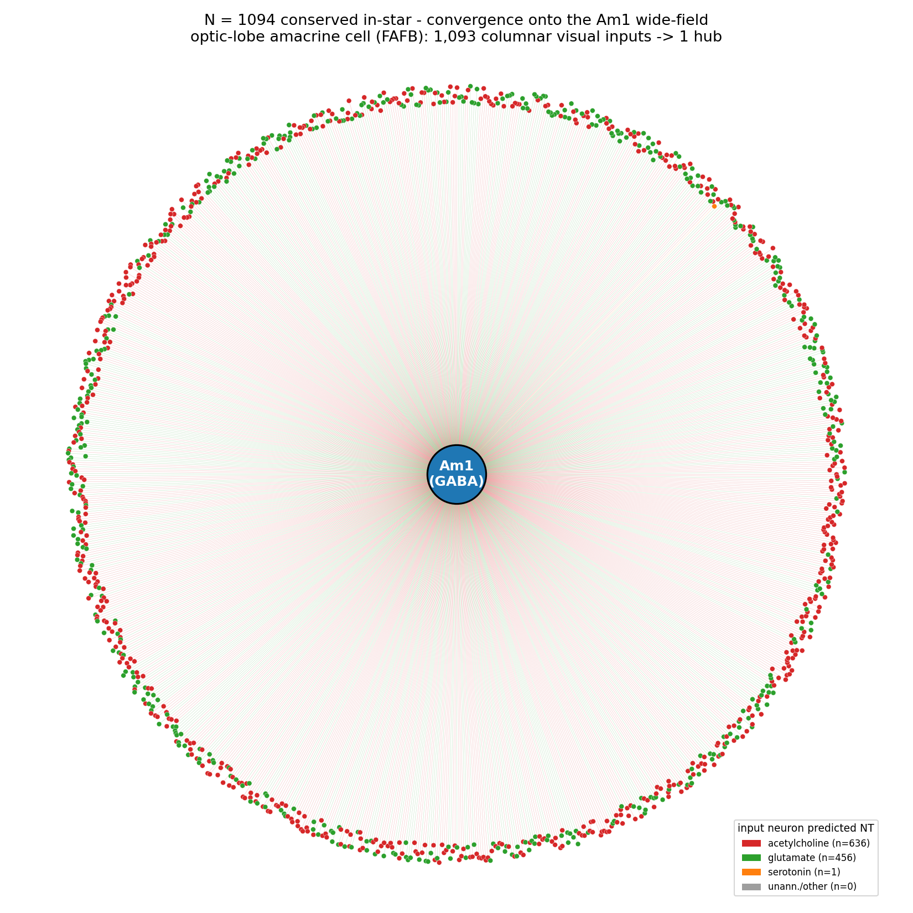
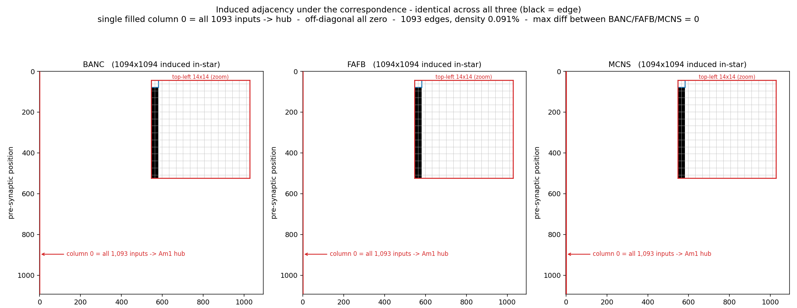

# Convergence onto the Am1 wide-field amacrine cell

**FlyWire qualification challenge — Research note (dataset: FAFB v783)**

The shared circuit identified across BANC, FAFB and MCNS is a directed **in-star**: 1,093 columnar visual interneurons converge onto a single hub with no connections among themselves (induced adjacency element-wise identical across all three connectomes). Here I use the Codex metadata for the **FAFB** dataset to interpret that hub biologically.

## The hub (FAFB Codex metadata)
The hub `root_id 720575940628307026` is annotated **`Am1`** — a wide-field amacrine neuron of the optic lobe (`super_class = optic`, `cell_class LOP>ME.LO`, arbor spanning medulla → lobula → lobula plate), predicted neurotransmitter **GABA** (inhibitory). It is among the highest-convergence cells in the visual system (FAFB in-degree ≈ 2,246). The identity is conserved: BANC labels it `medulla_lobula_lobula_plate_amacrine` (GABA) and MCNS labels it `Am1` (`ol_intrinsic`).

The **1,093 inputs** are optic-lobe columnar interneurons (1,087/1,093 `super_class = optic`; types `ME>LO.LOP`, `LO>LOP`, `ME>LOP`; ≈58 % cholinergic / ≈42 % glutamatergic by `top_nt`). In MCNS the same input set resolves to **T5b, T4b and TmY5a** — the canonical direction-selective motion detectors (T4 = ON, T5 = OFF) plus transmedullary-Y cells — confirming the convergence draws from the **motion-detection columnar array**.

## Fig. 1 — Circuit as a network graph

*The conserved in-star (FAFB): 1,093 columnar visual interneurons (red = cholinergic, green = glutamatergic) converging on the central GABAergic Am1 hub. The induced adjacency is one filled column with no input–input edges.*

## Fig. 2 — Isomorphism proof (induced adjacency)

*The 1094×1094 induced adjacency of the matched neurons, rebuilt independently from each dataset's edge list and found **element-wise identical** across BANC, FAFB and MCNS: a single filled row/column (all 1,093 leaves → the Am1 hub) and zeros elsewhere — the structural signature of a clean directed in-star with an independent-set leaf population. To inspect the constituent cells in 3D, the FAFB root IDs (hub first) are in `data/fafb_root_ids.txt`; load them via `data/codex_query.txt` or `data/neuroglancer_link.txt` in Codex (FAFB).*

## Interpretation / hypothesis
A single **wide-field GABAergic amacrine cell pooling ~1,000–2,600 columnar inputs across the entire retinotopic mosaic** is the textbook architecture for **spatial pooling and global gain control / divisive normalization** in early vision. Because the inputs are enriched for T4/T5/TmY motion-pathway neurons, I hypothesise that Am1 supplies a **field-wide inhibitory "common-mode" signal** — a panoramic estimate of motion/luminance against which local columnar motion channels are normalised — stabilising motion estimates across changes in contrast and illumination. That the *maximum* common convergence motif independently centres on Am1 in three connectomes marks it as a stereotyped, high-priority integration node of the visual system. (The exact count, 1,094, reflects independent-set selection bounded by BANC's Am1; the conserved biology is the convergence itself, not the number.)

## References
1. Dorkenwald S. *et al.* (2024) Neuronal wiring diagram of an adult brain. *Nature* 634:124–138 (FlyWire / FAFB).
2. Matsliah A. *et al.* (2024) Neuronal parts list and wiring diagram for a visual system. *Nature* 634:166–180 (FlyWire optic lobe; amacrine / wide-field cell types).
3. Maisak M.S. *et al.* (2013) A directional tuning map of *Drosophila* elementary motion detectors. *Nature* 500:212–216 (T4/T5).
4. Borst A., Haag J., Reiff D.F. (2010) Fly motion vision. *Annu. Rev. Neurosci.* 33:49–70.
5. Drews M.S. *et al.* (2020) Dynamic signal compression for robust motion vision in flies. *Neuron* 104:1–17 (optic-lobe gain control / normalization).
